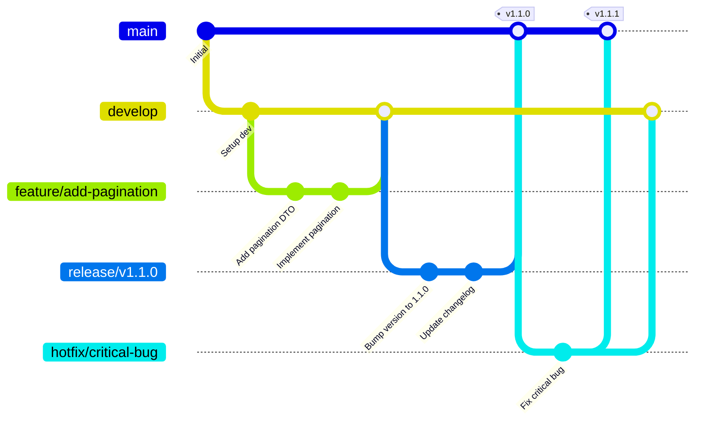

# Git Branching Strategy

## 📋 İçindekiler
- [Branching Modelleri](#branching-modelleri)
- [Git Flow](#git-flow)
- [GitHub Flow](#github-flow)
- [Branch Tipleri](#branch-tipleri)
- [İsimlendirme Kuralları](#isimlendirme-kuralları)
- [Workflow Örnekleri](#workflow-örnekleri)

---

## Branching Modelleri

### Git Flow (Detaylı Model)
Vincent Driessen tarafından geliştirilen, büyük ve karmaşık projeler için uygun branching stratejisi.

**Ana Branch'ler:**
- `main` (production-ready kod)
- `develop` (geliştirme branch'i)

**Destek Branch'leri:**
- `feature/*` (yeni özellikler)
- `release/*` (release hazırlığı)
- `hotfix/*` (production bug fix)

**Avantajları:**
- ✅ Organize ve yapılandırılmış
- ✅ Parallel geliştirme desteği
- ✅ Release yönetimi kolay
- ✅ Hotfix mekanizması

**Dezavantajları:**
- ❌ Karmaşık (küçük takımlar için)
- ❌ Çok fazla branch
- ❌ Merge çakışması riski

### GitHub Flow (Basit Model)
GitHub tarafından önerilen, continuous deployment için optimize edilmiş basit strateji.

**Branch Yapısı:**
- `main` (her zaman deploy edilebilir)
- `feature/*` (tüm değişiklikler için)

**Workflow:**
1. `main`'den branch oluştur
2. Değişiklikleri commit et
3. Pull Request aç
4. Review ve test
5. `main`'e merge et
6. Otomatik deploy

**Avantajları:**
- ✅ Çok basit ve anlaşılır
- ✅ CI/CD ile mükemmel uyum
- ✅ Hızlı iterasyon
- ✅ Az merge conflict

**Dezavantajları:**
- ❌ Release planlama zor
- ❌ Hotfix mekanizması yok
- ❌ Production ve dev aynı branch

---

## Branch Tipleri

### 1. Main Branch
```bash
main
```
- **Amaç:** Production-ready kod
- **Koruma:** Protected (direct push yasak)
- **Merge:** Sadece PR ile
- **Tag:** Her release için version tag

### 2. Develop Branch
```bash
develop
```
- **Amaç:** Geliştirme branch'i (integration)
- **Kaynak:** `main`'den branching
- **Merge To:** `main` (release zamanı)
- **Kullanım:** Tüm feature'ların birleştiği branch

### 3. Feature Branch
```bash
feature/add-pagination
feature/user-authentication
feature/export-csv
```
- **Amaç:** Yeni özellik geliştirme
- **Kaynak:** `develop`'tan branching
- **Merge To:** `develop`
- **Ömür:** Geliştirme süresince (kısa)
- **Silme:** Merge sonrası silinir

### 4. Release Branch
```bash
release/v1.1.0
release/v2.0.0
```
- **Amaç:** Release hazırlığı (bug fix, version bump)
- **Kaynak:** `develop`'tan branching
- **Merge To:** `main` VE `develop`
- **Ömür:** Release tamamlanana kadar
- **Tag:** Merge sonrası version tag

### 5. Hotfix Branch
```bash
hotfix/critical-security-bug
hotfix/payment-error
```
- **Amaç:** Production'daki kritik bug fix
- **Kaynak:** `main`'den branching
- **Merge To:** `main` VE `develop`
- **Ömür:** Fix tamamlanana kadar (çok kısa)
- **Tag:** Version patch (v1.0.0 → v1.0.1)

---

## İsimlendirme Kuralları

### Branch İsimlendirme
```bash
# Feature branches
feature/add-pagination
feature/implement-search
feature/user-profile

# Bugfix branches
bugfix/fix-login-error
bugfix/resolve-memory-leak

# Hotfix branches
hotfix/critical-security-bug
hotfix/payment-gateway-error

# Release branches
release/v1.1.0
release/v2.0.0-beta

# Experiment branches
experiment/new-ui-design
experiment/performance-optimization
```

### Commit Message Kuralları
```bash
# Format: <type>(<scope>): <subject>

feat(auth): add JWT token refresh mechanism
fix(api): resolve null pointer exception in TodosController
docs(readme): update installation instructions
style(frontend): format code with prettier
refactor(services): simplify authentication logic
test(backend): add unit tests for TodoService
chore(deps): update dependencies to latest versions
perf(database): optimize query performance
```

**Commit Types:**
- `feat`: Yeni özellik
- `fix`: Bug fix
- `docs`: Dokümantasyon
- `style`: Formatting, noktalama vb.
- `refactor`: Code refactoring
- `test`: Test ekleme/düzeltme
- `chore`: Build, config değişiklikleri
- `perf`: Performance iyileştirme

---

## Workflow Örnekleri

### Git Flow Workflow



### 1. Feature Geliştirme

**Senaryo:** Pagination özelliği ekle

```bash
# 1. develop branch'ine geç
git checkout develop
git pull origin develop

# 2. Feature branch oluştur
git checkout -b feature/add-pagination

# 3. Değişiklikleri yap
# ... kod yazıyorsun ...

# 4. Commit et
git add .
git commit -m "feat(api): add pagination support to todos endpoint"

# 5. Push et
git push origin feature/add-pagination

# 6. GitHub'da Pull Request aç
# develop <- feature/add-pagination

# 7. Review sonrası merge et
git checkout develop
git merge --no-ff feature/add-pagination
git push origin develop

# 8. Feature branch'ini sil
git branch -d feature/add-pagination
git push origin --delete feature/add-pagination
```

### 2. Release Hazırlama

**Senaryo:** v1.1.0 release hazırla

```bash
# 1. develop'tan release branch oluştur
git checkout develop
git checkout -b release/v1.1.0

# 2. Version'ı güncelle
# version.json: "1.0.0" -> "1.1.0"
git add version.json
git commit -m "chore(release): bump version to 1.1.0"

# 3. CHANGELOG güncelle
git add CHANGELOG.md
git commit -m "docs(changelog): update for v1.1.0 release"

# 4. Bug fix'ler varsa (sadece release için)
git commit -m "fix(release): resolve minor UI issues"

# 5. main'e merge et ve tag ekle
git checkout main
git merge --no-ff release/v1.1.0
git tag -a v1.1.0 -m "Release version 1.1.0"
git push origin main --tags

# 6. develop'a da merge et (release değişikliklerini al)
git checkout develop
git merge --no-ff release/v1.1.0
git push origin develop

# 7. Release branch'ini sil
git branch -d release/v1.1.0
git push origin --delete release/v1.1.0
```

### 3. Hotfix Uygulama

**Senaryo:** Production'da kritik bug

```bash
# 1. main'den hotfix branch oluştur
git checkout main
git checkout -b hotfix/critical-security-bug

# 2. Bug'ı fix et
# ... kod yazıyorsun ...
git add .
git commit -m "fix(security): resolve SQL injection vulnerability"

# 3. main'e merge et (PATCH version)
git checkout main
git merge --no-ff hotfix/critical-security-bug
git tag -a v1.1.1 -m "Hotfix: Security vulnerability"
git push origin main --tags

# 4. develop'a da merge et (gelecek release'lere dahil et)
git checkout develop
git merge --no-ff hotfix/critical-security-bug
git push origin develop

# 5. Hotfix branch'ini sil
git branch -d hotfix/critical-security-bug
git push origin --delete hotfix/critical-security-bug

# 6. Hemen deploy et!
./deploy.sh
```

### 4. GitHub Flow (Basit)

```bash
# 1. main'den branch oluştur
git checkout main
git pull origin main
git checkout -b feature/add-search

# 2. Değişiklikleri yap ve commit et
git add .
git commit -m "feat: add search functionality"
git push origin feature/add-search

# 3. Pull Request aç
# main <- feature/add-search

# 4. CI/CD otomatik test eder
# Yeşil olunca review

# 5. Merge et
git checkout main
git merge feature/add-search
git push origin main

# 6. Otomatik deploy tetiklenir
# CI/CD pipeline çalışır

# 7. Branch'i sil
git branch -d feature/add-search
git push origin --delete feature/add-search
```

---

## Best Practices

### ✅ Yapılması Gerekenler

1. **Branch isimlendirme standartına uy**
   ```bash
   ✅ feature/add-pagination
   ❌ my-branch
   ❌ test
   ```

2. **Küçük ve sık commit'ler at**
   ```bash
   ✅ "feat(auth): add login endpoint"
   ✅ "test(auth): add login tests"
   ❌ "lots of changes"
   ```

3. **Pull Request kullan (code review)**
   - Her feature için PR
   - En az 1 reviewer
   - CI/CD pass zorunlu

4. **Branch'leri güncel tut**
   ```bash
   git checkout feature/my-feature
   git merge develop  # veya git rebase develop
   ```

5. **Merge sonrası branch sil**
   ```bash
   git branch -d feature/completed-feature
   git push origin --delete feature/completed-feature
   ```

### ❌ Yapılmaması Gerekenler

1. **Direct push to main**
   ```bash
   ❌ git push origin main
   ✅ Pull Request kullan
   ```

2. **Çok uzun süre yaşayan feature branch'ler**
   ```bash
   ❌ 3 ay boyunca merge edilmeyen branch
   ✅ Max 1-2 hafta
   ```

3. **Gereksiz branch'ler**
   ```bash
   ❌ test, deneme, test2, backup
   ✅ feature/descriptive-name
   ```

4. **Merge conflict'leri göz ardı etme**
   ```bash
   ✅ Conflict'i düzgün çöz
   ✅ Test et
   ✅ Sonra merge et
   ```

---

## Branch Protection Rules

### GitHub Repository Settings

```yaml
# main branch protection
main:
  - Require pull request reviews: ✅
  - Required approvals: 1
  - Dismiss stale reviews: ✅
  - Require status checks: ✅
    - CI/CD pipeline must pass
    - Code coverage > 80%
  - Require branches be up to date: ✅
  - Include administrators: ✅
  - Restrict push: ✅

# develop branch protection
develop:
  - Require pull request reviews: ✅
  - Required approvals: 1
  - Require status checks: ✅
```

---

## Proje Branching Stratejisi

Bu projede **Git Flow** kullanıyoruz:

```
main (production)
├── develop (integration)
│   ├── feature/add-pagination
│   ├── feature/user-authentication
│   └── feature/export-csv
├── release/v1.1.0 (release preparation)
└── hotfix/critical-bug (emergency fixes)
```

**Neden Git Flow?**
- ✅ Backend + Frontend + Database (complex)
- ✅ Release planning gerekli
- ✅ Hotfix mekanizması önemli
- ✅ Takım > 2 kişi

---

## Kaynaklar

- [Git Flow Original Article](https://nvie.com/posts/a-successful-git-branching-model/)
- [GitHub Flow Guide](https://docs.github.com/en/get-started/quickstart/github-flow)
- [Atlassian Git Tutorials](https://www.atlassian.com/git/tutorials/comparing-workflows)
- [Conventional Commits](https://www.conventionalcommits.org/)
