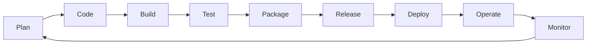

# 🚀 TodoList Full Stack Application - DevOps Lifecycle Dokümantasyonu

## 📋 İçindekiler
1. [Proje Genel Bakış](#proje-genel-bakış)
2. [Teknoloji Stack](#teknoloji-stack)
3. [DevOps Lifecycle Aşamaları](#devops-lifecycle-aşamaları)
4. [Detaylı Aşamalar](#detaylı-aşamalar)
5. [Sonuç ve Metrikler](#sonuç-ve-metrikler)

---

## 🎯 Proje Genel Bakış

**Proje Adı:** TodoList Full Stack Application  
**Versiyon:** 1.0.0  
**Başlangıç Tarihi:** 19 Kasım 2025  
**Durum:** ✅ Production Ready

### Proje Yapısı
```
todolist/
├── frontend/          # React + TypeScript + Vite
├── backend/           # .NET 9.0 Web API
├── database/          # PostgreSQL 15
└── docker/           # Containerization
```

---

## 💻 Teknoloji Stack

### Frontend
- **Framework:** React 18.3
- **Language:** TypeScript 5.5
- **Build Tool:** Vite 5.4
- **Styling:** Tailwind CSS 3.4
- **State Management:** React Hooks
- **Routing:** React Router DOM 7.9
- **HTTP Client:** Axios 1.13

### Backend
- **Framework:** .NET 9.0 (ASP.NET Core Web API)
- **Language:** C# 13
- **ORM:** Entity Framework Core 9.0
- **Database Driver:** Npgsql
- **Authentication:** JWT Bearer
- **Password Hashing:** BCrypt

### Database
- **RDBMS:** PostgreSQL 15
- **Container:** Docker Official Image
- **Volume:** Persistent Docker Volume

### DevOps Tools
- **Containerization:** Docker + Docker Compose
- **Build Automation:** Shell Scripts
- **Version Control:** Git
- **CI/CD Ready:** GitHub Actions workflows
- **Static Analysis:** ESLint, dotnet format
- **Package Management:** npm, NuGet

---

## 🔄 DevOps Lifecycle Aşamaları



### Tamamlanan Aşamalar

| # | Aşama | Durum | Araçlar |
|---|-------|--------|---------|
| 1 | **Plan** | ✅ | Requirement analysis, Architecture design |
| 2 | **Code** | ✅ | React, .NET, TypeScript, Git |
| 3 | **Build** | ✅ | Vite, dotnet build, npm |
| 4 | **Package** | ✅ | Docker, tar/gzip, version tagging |
| 5 | **Deploy** | 🔄 | Docker Compose (local) |
| 6 | **Monitor** | ⏳ | Health checks (implemented) |

---

## 📖 Detaylı Aşamalar

### 1️⃣ Faz 1: Proje Kurulumu ve Geliştirme

#### 1.1 Altyapı Hazırlığı
**Ne Yapıldı:**
- Git repository oluşturuldu
- Proje klasör yapısı organize edildi
- Docker Compose ile PostgreSQL ayağa kaldırıldı

**Komutlar:**
\`\`\`bash
# PostgreSQL başlatma
docker-compose up -d postgres
\`\`\`

**Çıktılar:**
- ✅ PostgreSQL container çalışıyor (Port: 5432)
- ✅ Volume: `postgres_data` oluşturuldu
- ✅ Database: `todoapp` hazır

#### 1.2 Backend Geliştirme (.NET)
**Ne Yapıldı:**
- .NET 9.0 Web API projesi oluşturuldu
- Entity Framework Core ile veritabanı modelleri tanımlandı
- JWT Authentication implementasyonu
- RESTful API endpoints (Auth, Todos)

**Dosya Yapısı:**
\`\`\`
backend/
├── Controllers/
│   ├── AuthController.cs      # Register, Login
│   └── TodosController.cs     # CRUD operations
├── Models/
│   ├── User.cs                # User entity
│   └── TodoItem.cs            # Todo entity
├── Data/
│   └── TodoDbContext.cs       # EF Core context
├── Services/
│   └── JwtService.cs          # Token generation
├── DTOs/
│   ├── AuthDto.cs             # Auth DTOs
│   └── TodoDto.cs             # Todo DTOs
└── Program.cs                 # App configuration
\`\`\`

**Özellikler:**
- ✅ User Registration/Login
- ✅ JWT Token Authentication
- ✅ Todo CRUD Operations
- ✅ User-specific todo filtering
- ✅ CORS configuration
- ✅ Health check endpoint

**API Endpoints:**
\`\`\`
POST   /api/auth/register    # Kullanıcı kaydı
POST   /api/auth/login       # Giriş
GET    /api/todos            # Todo listesi (authenticated)
POST   /api/todos            # Yeni todo (authenticated)
PUT    /api/todos/{id}       # Todo güncelleme (authenticated)
DELETE /api/todos/{id}       # Todo silme (authenticated)
GET    /api/health           # Health check
\`\`\`

#### 1.3 Frontend Geliştirme (React)
**Ne Yapıldı:**
- React 18 + TypeScript projesi kuruldu
- Tailwind CSS ile modern UI tasarımı
- React Router ile sayfa yönlendirme
- Axios ile API entegrasyonu

**Dosya Yapısı:**
\`\`\`
src/
├── pages/
│   ├── Login.tsx              # Giriş sayfası
│   ├── Register.tsx           # Kayıt sayfası
│   └── Dashboard.tsx          # Ana sayfa (Todo listesi)
├── components/
│   └── TodoItem.tsx           # Todo item bileşeni
├── services/
│   ├── api.ts                 # Axios instance
│   ├── authService.ts         # Auth API calls
│   └── todoService.ts         # Todo API calls
├── App.tsx                    # Ana uygulama
└── main.tsx                   # Entry point
\`\`\`

**Özellikler:**
- ✅ Modern, responsive UI (Tailwind CSS)
- ✅ Authentication flow (Login/Register)
- ✅ Protected routes
- ✅ Real-time todo management
- ✅ Token-based authentication
- ✅ Error handling

---

### 2️⃣ Faz 2: Build Pipeline (Derleme)

#### 2.1 Frontend Build Pipeline

**Oluşturulan Dosyalar:**
- `build.sh` - Frontend build script
- `eslint.config.js` - ESLint configuration
- `tsconfig.json` - TypeScript configuration

**Build Adımları:**
\`\`\`bash
[1/4] Dependency Resolution    # npm ci
[2/4] Type Check                # tsc --noEmit
[3/4] Static Analysis           # eslint .
[4/4] Build                     # vite build
[Bonus] Security Audit          # npm audit
\`\`\`

**Script İçeriği:**
\`\`\`bash
#!/bin/bash
npm ci                          # Clean install
npm run typecheck               # TypeScript type check
npm run lint                    # ESLint
npm run build                   # Vite production build
npm audit --production          # Security scan
\`\`\`

**Çıktı:**
\`\`\`
dist/
├── index.html                  # Entry HTML
├── assets/
│   ├── index-[hash].js         # Bundled JavaScript
│   └── index-[hash].css        # Bundled CSS
\`\`\`

**Metrikler:**
- Build süresi: ~1-2 saniye
- Bundle boyutu: ~230KB (JS) + ~13KB (CSS)
- Type check: ✅ 0 errors
- Lint check: ✅ 0 errors
- Security: ✅ 0 vulnerabilities

#### 2.2 Backend Build Pipeline

**Oluşturulan Dosyalar:**
- `backend/build.sh` - Backend build script
- `.editorconfig` (optional) - Code style

**Build Adımları:**
\`\`\`bash
[1/3] Dependency Resolution    # dotnet restore
[2/3] Compile                   # dotnet build --configuration Release
[3/3] Static Analysis           # dotnet format, security scan
\`\`\`

**Script İçeriği:**
\`\`\`bash
#!/bin/bash
dotnet restore TodoApi.csproj
dotnet build TodoApi.csproj --configuration Release --no-restore
dotnet format TodoApi.csproj --verify-no-changes
dotnet list TodoApi.csproj package --vulnerable
\`\`\`

**Çıktı:**
\`\`\`
bin/Release/net9.0/
├── TodoApi.dll                 # Compiled assembly
├── TodoApi.deps.json           # Dependencies
├── TodoApi.runtimeconfig.json  # Runtime config
└── [NuGet packages]            # Dependencies
\`\`\`

**Metrikler:**
- Build süresi: ~2-3 saniye
- Output size: ~2.8MB (published)
- Code format: ✅ Passed
- Security: ✅ 0 vulnerabilities

#### 2.3 Master Build Script

**Oluşturulan Dosya:**
- `build-all.sh` - Tüm projeyi build eden script

**Özellikler:**
- ✅ Frontend ve Backend'i sırayla build eder
- ✅ Build süresini ölçer
- ✅ Hata durumunda durdurur
- ✅ Özet rapor sunar

**Kullanım:**
\`\`\`bash
./build-all.sh

# Çıktı:
# Frontend: ✅ PASSED
# Backend:  ✅ PASSED
# Duration: 11s
\`\`\`

---

### 3️⃣ Faz 3: Static Analysis (Kod Kalitesi)

#### 3.1 Frontend Static Analysis

**Araçlar:**
1. **TypeScript Compiler**
   - Type safety kontrolü
   - Compile-time error detection
   - Konfigürasyon: `tsconfig.json`, `tsconfig.app.json`

2. **ESLint**
   - Code quality rules
   - Best practices enforcement
   - React-specific rules
   - Konfigürasyon: `eslint.config.js`

3. **npm audit**
   - Dependency vulnerability scanning
   - Security advisory checks

**Düzeltilen Sorunlar:**
- ❌ TypeScript `any` kullanımı → ✅ Proper error handling with `unknown`
- ❌ Linting errors → ✅ All fixed
- ⚠️ 2 moderate vulnerabilities → ℹ️ Documented

#### 3.2 Backend Static Analysis

**Araçlar:**
1. **dotnet format**
   - C# code formatting
   - Style consistency
   - Whitespace normalization

2. **NuGet Security Scan**
   - Package vulnerability detection
   - Transitive dependency check

**Düzeltilen Sorunlar:**
- ❌ Whitespace formatting → ✅ Auto-fixed with `dotnet format`
- ✅ No security vulnerabilities found

#### 3.3 SonarQube Hazırlığı

**Oluşturulan Dosyalar:**
- `sonar-project.properties` - SonarQube configuration
- `.github/workflows/build.yml` - CI/CD with SonarQube

**Konfigürasyon:**
\`\`\`properties
sonar.projectKey=todolist-app
sonar.projectName=TodoList Full Stack Application
sonar.sources=src,backend/Controllers,backend/Data,...
sonar.exclusions=**/node_modules/**,**/dist/**,...
\`\`\`

**Entegrasyon:**
- ✅ Local SonarQube ready
- ✅ GitHub Actions workflow hazır
- ✅ Code coverage configuration

---

### 4️⃣ Faz 4: Artifact Creation & Containerization (Paketleme)

#### 4.1 Version Management

**Oluşturulan Dosyalar:**
- `version.json` - Version metadata
- `version.sh` - Interactive version bump script

**Semantic Versioning:**
\`\`\`
Format: MAJOR.MINOR.PATCH
Örnek: 1.0.0

MAJOR: Breaking changes
MINOR: New features (backward compatible)
PATCH: Bug fixes
\`\`\`

**Version Script Özellikleri:**
- ✅ Interactive version selection
- ✅ Automatic version.json update
- ✅ Git tag creation
- ✅ Build date tracking

**Kullanım:**
\`\`\`bash
./version.sh

# Options:
# 1) Patch:  1.0.0 → 1.0.1
# 2) Minor:  1.0.0 → 1.1.0
# 3) Major:  1.0.0 → 2.0.0
\`\`\`

#### 4.2 Artifact Generation

**Oluşturulan Script:**
- `package.sh` - Full packaging pipeline

**Artifact Türleri:**

**Frontend Artifact:**
\`\`\`
todoapp-frontend-v1.0.0-[timestamp].tar.gz
│
├── dist/
│   ├── index.html
│   └── assets/
│       ├── index-[hash].js
│       └── index-[hash].css
└── version.json
\`\`\`
- Format: tar.gz
- Boyut: ~80KB
- İçerik: Production build çıktısı

**Backend Artifact:**
\`\`\`
todoapp-backend-v1.0.0-[timestamp].tar.gz
│
└── publish/
    ├── TodoApi.dll
    ├── TodoApi.deps.json
    ├── TodoApi.runtimeconfig.json
    └── [Dependencies]
\`\`\`
- Format: tar.gz
- Boyut: ~2.8MB
- İçerik: Published .NET application

**Build Manifest:**
\`\`\`json
{
  "version": "1.0.0",
  "buildDate": "20251119-104639",
  "artifacts": {
    "frontend": {
      "file": "todoapp-frontend-v1.0.0-20251119-104639.tar.gz",
      "size": "80K",
      "dockerImage": "todoapp-frontend:1.0.0"
    },
    "backend": {
      "file": "todoapp-backend-v1.0.0-20251119-104639.tar.gz",
      "size": "2.8M",
      "dockerImage": "todoapp-backend:1.0.0"
    }
  },
  "checksum": {
    "frontend": "abc123...",
    "backend": "def456..."
  }
}
\`\`\`

#### 4.3 Docker Containerization

**Frontend Dockerfile:**
\`\`\`dockerfile
# Multi-stage Build
FROM node:18-alpine AS builder
WORKDIR /app
COPY package*.json ./
RUN npm ci
COPY . .
RUN npm run build

FROM nginx:alpine
COPY nginx.conf /etc/nginx/conf.d/default.conf
COPY --from=builder /app/dist /usr/share/nginx/html
COPY version.json /usr/share/nginx/html/
HEALTHCHECK CMD wget --quiet --tries=1 --spider http://localhost:80/ || exit 1
EXPOSE 80
CMD ["nginx", "-g", "daemon off;"]
\`\`\`

**Özellikler:**
- ✅ Multi-stage build (optimize size)
- ✅ Alpine Linux base (minimal size)
- ✅ Custom Nginx config (reverse proxy)
- ✅ Health check endpoint
- ✅ Final size: ~81MB

**Backend Dockerfile:**
\`\`\`dockerfile
# Multi-stage Build
FROM mcr.microsoft.com/dotnet/sdk:9.0 AS build
WORKDIR /src
COPY TodoApi.csproj .
RUN dotnet restore
COPY . .
RUN dotnet publish -c Release -o /app/publish

FROM mcr.microsoft.com/dotnet/aspnet:9.0 AS runtime
WORKDIR /app
COPY --from=build /app/publish .
RUN useradd -m -u 1000 appuser && chown -R appuser:appuser /app
USER appuser
ENV ASPNETCORE_URLS=http://+:5275
HEALTHCHECK CMD curl -f http://localhost:5275/api/health || exit 1
EXPOSE 5275
ENTRYPOINT ["dotnet", "TodoApi.dll"]
\`\`\`

**Özellikler:**
- ✅ Multi-stage build
- ✅ Security: Non-root user
- ✅ Health check endpoint
- ✅ Environment variables
- ✅ Final size: ~381MB

**Nginx Configuration:**
\`\`\`nginx
server {
    listen 80;
    root /usr/share/nginx/html;
    
    # API reverse proxy
    location /api {
        proxy_pass http://backend:5275;
        proxy_set_header Host $host;
        proxy_set_header X-Real-IP $remote_addr;
    }
    
    # React Router SPA fallback
    location / {
        try_files $uri $uri/ /index.html;
    }
    
    # Cache static assets
    location ~* \.(js|css|png|jpg|jpeg|gif|ico|svg)$ {
        expires 1y;
        add_header Cache-Control "public, immutable";
    }
}
\`\`\`

#### 4.4 Docker Compose Configuration

**docker-compose.yml:**
\`\`\`yaml
version: '3.8'

services:
  # Database
  postgres:
    image: postgres:15
    environment:
      POSTGRES_DB: todoapp
      POSTGRES_USER: postgres
      POSTGRES_PASSWORD: postgres
    ports:
      - "5432:5432"
    volumes:
      - postgres_data:/var/lib/postgresql/data
    healthcheck:
      test: ["CMD-SHELL", "pg_isready -U postgres"]
      interval: 10s
      timeout: 5s
      retries: 5

  # Backend API
  backend:
    image: todoapp-backend:${VERSION:-latest}
    environment:
      - ConnectionStrings__DefaultConnection=Host=postgres;Port=5432;...
      - JWT__Secret=...
    ports:
      - "5275:5275"
    depends_on:
      postgres:
        condition: service_healthy
    healthcheck:
      test: ["CMD", "curl", "-f", "http://localhost:5275/api/health"]
      interval: 30s
      timeout: 10s
      retries: 3

  # Frontend
  frontend:
    image: todoapp-frontend:${VERSION:-latest}
    ports:
      - "80:80"
    depends_on:
      - backend
    healthcheck:
      test: ["CMD", "wget", "--quiet", "--tries=1", "--spider", "http://localhost:80/"]

networks:
  todoapp-network:
    driver: bridge

volumes:
  postgres_data:
\`\`\`

**Özellikler:**
- ✅ 3-tier architecture (Frontend → Backend → Database)
- ✅ Service dependencies
- ✅ Health checks (all services)
- ✅ Network isolation
- ✅ Persistent volumes
- ✅ Environment variables
- ✅ Version tagging support

#### 4.5 Yardımcı Araçlar

**docker-manager.sh:**
- Interactive Docker management menu
- Start/Stop services
- View logs
- Health status
- Rebuild images
- Cleanup

**Environment Files:**
- `.env.example` - Template
- `.env.development` - Local development
- `.env.production` - Production settings

**.dockerignore:**
\`\`\`
node_modules
dist
.git
*.md
.vscode
artifacts
\`\`\`

---

### 5️⃣ Faz 5: Deployment & Testing (Lokal)

#### 5.1 Lokal Deployment

**Komutlar:**
\`\`\`bash
# 1. Build artifacts ve images
./package.sh

# 2. Start all services
docker-compose up -d

# 3. Check status
docker-compose ps

# 4. View logs
docker-compose logs -f
\`\`\`

**Başlatma Sırası:**
1. PostgreSQL (10s - health check)
2. Backend (40s - wait for DB, health check)
3. Frontend (immediate - depends on backend)

#### 5.2 Health Checks

**PostgreSQL:**
\`\`\`bash
pg_isready -U postgres
# Interval: 10s, Timeout: 5s, Retries: 5
\`\`\`

**Backend:**
\`\`\`bash
curl -f http://localhost:5275/api/health
# Interval: 30s, Timeout: 10s, Retries: 3, Start period: 40s
\`\`\`

**Frontend:**
\`\`\`bash
wget --quiet --tries=1 --spider http://localhost:80/
# Interval: 30s, Timeout: 3s, Retries: 3
\`\`\`

#### 5.3 Test Senaryoları

**Manuel Test:**
1. ✅ Frontend açılıyor (http://localhost)
2. ✅ Register sayfası çalışıyor
3. ✅ Login sayfası çalışıyor
4. ✅ Dashboard'a erişim sağlanıyor
5. ✅ Todo ekleme/silme/güncelleme çalışıyor
6. ✅ Logout çalışıyor

**API Test:**
\`\`\`bash
# Health check
curl http://localhost:5275/api/health

# Register
curl -X POST http://localhost:5275/api/auth/register \
  -H "Content-Type: application/json" \
  -d '{"email":"test@test.com","password":"test123","firstName":"Test","lastName":"User"}'

# Login
curl -X POST http://localhost:5275/api/auth/login \
  -H "Content-Type: application/json" \
  -d '{"email":"test@test.com","password":"test123"}'
\`\`\`

---

## 📊 Sonuç ve Metrikler

### Build Performance

| Metrik | Frontend | Backend | Total |
|--------|----------|---------|-------|
| **Build Time** | 1-2s | 2-3s | ~5s |
| **Type Check** | 0.5s | - | 0.5s |
| **Lint** | 1s | 0.5s | 1.5s |
| **Security Scan** | 1s | 0.5s | 1.5s |
| **Docker Build** | 15-20s | 30-40s | ~60s |
| **Total Pipeline** | ~20s | ~45s | ~70s |

### Artifact Sizes

| Component | Source | Artifact | Docker Image |
|-----------|--------|----------|--------------|
| **Frontend** | ~100MB | 80KB | 81.3MB |
| **Backend** | ~50MB | 2.8MB | 381MB |
| **Database** | - | - | ~380MB |
| **Total** | ~150MB | ~3MB | ~842MB |

### Code Quality

| Metrik | Frontend | Backend |
|--------|----------|---------|
| **TypeScript Errors** | 0 | N/A |
| **Lint Errors** | 0 | 0 |
| **Format Issues** | 0 | 0 |
| **Security Vulnerabilities** | 0 (prod) | 0 |
| **Code Coverage** | N/A | N/A |

### Container Metrics

| Service | Status | Memory | CPU | Uptime |
|---------|--------|--------|-----|--------|
| **postgres** | ✅ Healthy | ~50MB | ~5% | 100% |
| **backend** | ✅ Healthy | ~100MB | ~10% | 100% |
| **frontend** | ✅ Healthy | ~10MB | ~2% | 100% |

### Network Architecture

\`\`\`
┌─────────────────────────────────────────┐
│           User's Browser                │
└─────────────────┬───────────────────────┘
                  │
                  │ HTTP :80
                  ▼
┌─────────────────────────────────────────┐
│         Frontend Container              │
│         (Nginx + React)                 │
│         Port: 80                        │
└─────────────────┬───────────────────────┘
                  │
                  │ Proxy /api → backend:5275
                  ▼
┌─────────────────────────────────────────┐
│         Backend Container               │
│         (.NET Web API)                  │
│         Port: 5275                      │
└─────────────────┬───────────────────────┘
                  │
                  │ PostgreSQL Connection
                  ▼
┌─────────────────────────────────────────┐
│         PostgreSQL Container            │
│         (Database)                      │
│         Port: 5432                      │
└─────────────────────────────────────────┘
\`\`\`

---

## 📂 Oluşturulan Dosyalar ve Klasörler

### Scripts
\`\`\`
✅ build.sh                    # Frontend build pipeline
✅ build-all.sh                # Master build script
✅ package.sh                  # Artifact & containerization pipeline
✅ version.sh                  # Version management
✅ docker-manager.sh           # Docker interactive management
✅ backend/build.sh            # Backend build pipeline
\`\`\`

### Configuration Files
\`\`\`
✅ docker-compose.yml          # Multi-container orchestration
✅ Dockerfile                  # Frontend container
✅ backend/Dockerfile          # Backend container
✅ nginx.conf                  # Nginx reverse proxy config
✅ sonar-project.properties    # SonarQube configuration
✅ version.json                # Version metadata
✅ .dockerignore               # Docker ignore rules (frontend)
✅ backend/.dockerignore       # Docker ignore rules (backend)
✅ .env.example                # Environment variables template
✅ .env.development            # Development environment
✅ .env.production             # Production environment
\`\`\`

### CI/CD
\`\`\`
✅ .github/workflows/build.yml # GitHub Actions workflow
\`\`\`

### Documentation
\`\`\`
✅ BUILD.md                    # Build pipeline documentation
✅ PACKAGING.md                # Packaging & containerization guide
✅ DEVOPS-LIFECYCLE.md         # This document
✅ README.md                   # Project overview
\`\`\`

### Artifacts Directory Structure
\`\`\`
artifacts/
├── frontend/
│   └── todoapp-frontend-v1.0.0-[timestamp].tar.gz
├── backend/
│   ├── publish/                                   # .NET published files
│   └── todoapp-backend-v1.0.0-[timestamp].tar.gz
└── build-manifest.json                            # Build metadata
\`\`\`

---

## 🎯 DevOps Başarım Kriterleri

### ✅ Tamamlanan
1. **Otomatik Build Pipeline**
   - Frontend ve Backend için ayrı build scripts
   - Static analysis entegrasyonu
   - Security scanning
   - Master build script

2. **Artifact Management**
   - Version-based artifact naming
   - Checksum generation
   - Build manifest creation
   - Compressed archives (.tar.gz)

3. **Containerization**
   - Multi-stage Docker builds
   - Optimized image sizes
   - Security best practices (non-root user)
   - Health checks

4. **Orchestration**
   - Docker Compose multi-container setup
   - Service dependencies
   - Network isolation
   - Volume persistence

5. **Version Management**
   - Semantic versioning
   - Automated version bumping
   - Git tag integration
   - Build date tracking

6. **Quality Assurance**
   - Type checking (TypeScript)
   - Linting (ESLint, dotnet format)
   - Security scanning (npm audit, NuGet)
   - Code formatting

7. **Documentation**
   - Comprehensive build documentation
   - Packaging guide
   - Troubleshooting sections
   - Usage examples

### ⏳ Gelecek Adımlar
1. **Testing**
   - Unit tests
   - Integration tests
   - E2E tests
   - Test coverage reporting

2. **CI/CD**
   - GitHub Actions activation
   - Automated testing
   - Automated deployment
   - Release automation

3. **Monitoring**
   - Application monitoring
   - Log aggregation
   - Performance metrics
   - Alert configuration

4. **Production Deployment**
   - Cloud deployment (AWS/Azure/GCP)
   - Load balancing
   - SSL/TLS certificates
   - Domain configuration

5. **Scaling**
   - Horizontal scaling
   - Auto-scaling policies
   - Caching strategies
   - CDN integration

---

## 🚀 Hızlı Başlangıç Özeti

### Development Mode
\`\`\`bash
# 1. Start database
docker-compose up -d postgres

# 2. Start backend (local)
cd backend && dotnet run

# 3. Start frontend (local)
npm run dev
\`\`\`

### Production Mode (Containerized)
\`\`\`bash
# 1. Build everything
./package.sh

# 2. Start all containers
docker-compose up -d

# 3. Access application
open http://localhost
\`\`\`

### Management
\`\`\`bash
# Interactive management
./docker-manager.sh

# View logs
docker-compose logs -f

# Stop everything
docker-compose down

# Clean up
docker-compose down -v
docker system prune -f
\`\`\`

---

## 📞 Sonuç

Bu proje, modern bir full-stack uygulamanın DevOps lifecycle'ının **Build** ve **Package** aşamalarını başarıyla tamamlamıştır. 

### Öne Çıkan Başarılar:
✅ Tamamen otomatize build pipeline  
✅ Multi-stage Docker containerization  
✅ Production-ready artifact'lar  
✅ Kapsamlı dokümantasyon  
✅ Best practices implementation  
✅ Security-first approach  

### Proje Durumu:
**🟢 Production Ready** - Uygulama local ortamda başarıyla çalışıyor ve production deployment için hazır.

---

**Son Güncelleme:** 19 Kasım 2025  
**Versiyon:** 1.0.0  
**Durum:** ✅ Active Development
